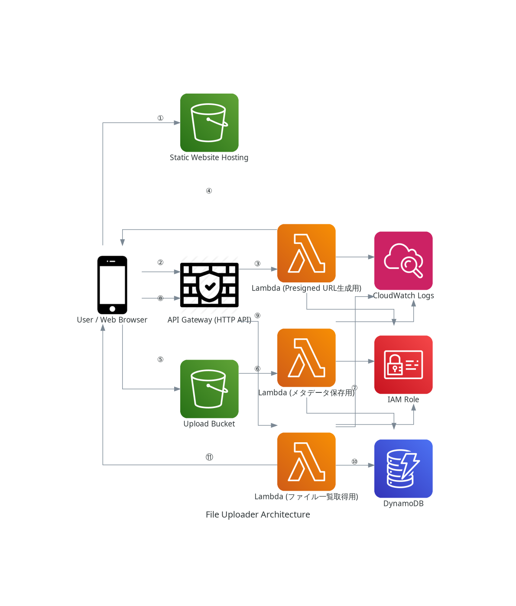

# サーバーレス ファイルアップローダー

## どんな人が、何を作って、何を得たのか (Who, What, and What was Gained)

**「S3を直接使えば、普段使っているクラウドストレージより安く、自分だけのものが作れるのでは？」**

この素朴な好奇心から、このプロジェクトはスタートしました。当初はシンプルなファイルの置き場所を考えていましたが、AI学習コーチと対話しながら開発を進める中で、「ただ動く」だけでなく、実務で求められる**セキュリティ、スケーラビリティ、そして保守性**をいかにして実現するかに挑戦することになりました。

開発の最終段階では、学習しながらとはいえ二か月かけてほぼ作成したものがコードの変更をきっかけにシステム全体が動かなくなるという大きな壁にもぶつかりました。AIを駆使しても同じ修正の指示を繰り返されて一時は途方に暮れました。しかし、その原因を地道に特定し、インフラ全体をゼロから再構築する経験を通じて、**「コードの裏側にある"なぜ"を理解することの重要性」**と、**「落ち着いて問題を切り分けるトラブルシューティング能力」**という、技術スキル以上に大切なことを学びました。

このリポジトリは、そんな試行錯誤の末に完成した、**Terraform(IaC)とAWSサーバーレス技術で構築したWebアプリケーション**の全記録です。

---

## 機能一覧 (Features)

- **ファイルアップロード機能:**
  - Webブラウザからファイルを選択し、プレビュー表示後にアップロードできます。
  - バックエンドでS3署名付きURLを動的に生成し、安全かつ効率的にS3へ直接ファイルをアップロードする仕組みを実装しています。
- **メタデータ自動保存機能:**
  - S3へのファイルアップロードをトリガーとして、Lambda関数が非同期で自動実行されます。
  - ファイル名、S3の保存先パス、ファイルサイズ等のメタデータがDynamoDBに自動的に記録されます。
- **ファイル一覧表示機能:**
  - アップロードされたファイルの一覧をAPI経由でDynamoDBから取得し、Webページ上に動的に表示します。

## アーキテクチャ図 (Architecture Diagram)




## 処理フロー (Processing Flow)

このアプリケーションの主要な機能は、以下の流れで実現されています。

### ファイルアップロード処理フロー
- **① サイト表示:** ユーザーがブラウザでS3の静的ウェブサイトにアクセスします。
- **② URLリクエスト:** JavaScriptがAPI Gateway (`POST /generate-presigned-url`) に署名付きURLを要求します。
- **③ Lambda実行 (URL生成):** API Gatewayが「署名付きURL生成Lambda」をトリガーします。
- **④ URL応答:** Lambdaが生成した署名付きURLをブラウザに返します。
- **⑤ ファイル送信:** JavaScriptが署名付きURLを使い、ファイル本体をS3バケットに直接アップロード (PUT) します。
- **⑥ イベント通知:** S3へのファイル作成をトリガーに、「メタデータ保存Lambda」が起動します。
- **⑦ メタデータ保存:** Lambdaがファイル情報をDynamoDBに書き込みます。

### ファイル一覧表示処理フロー
- **⑧ 一覧リクエスト:** JavaScriptがAPI Gateway (`GET /files`) にファイル一覧を要求します。
- **⑨ Lambda実行 (一覧取得):** API Gatewayが「ファイル一覧取得Lambda」をトリガーします。
- **⑩ DBスキャン:** LambdaがDynamoDBのテーブルをスキャンして全ファイル情報を取得します。
- **⑪ 一覧応答:** Lambdaが取得したファイルリストをブラウザに返します。

## 使用技術一覧 (Tech Stack)

### IaC (Infrastructure as Code)
- Terraform

### AWS (Backend)
- **API Gateway:** HTTP API
- **Lambda:** Python 3.11 Runtime
- **S3:** ファイルストレージ & 静的ウェブサイトホスティング
- **DynamoDB:** メタデータストレージ
- **IAM:** 各種権限管理 (ロール, ポリシー)
- **CloudWatch:** ログ監視

### Programming Language
- Python 3 (Boto3 - AWS SDK)

### Frontend
- HTML5
- CSS3 (Pico.css フレームワーク利用)
- JavaScript (ES6+, Fetch API)

## 使い方・動かし方 (Usage / How to Deploy)

このプロジェクトのインフラをAWS上にデプロイするための手順です。

### 必要なもの (Prerequisites)
- AWSアカウント & IAMユーザー（適切な権限を持つ）
- [AWS CLI](https://aws.amazon.com/jp/cli/) (設定済みであること)
- [Terraform](https://www.terraform.io/downloads.html) (v1.x 以降)
- [Git](https://git-scm.com/downloads)

### 手順
1. **リポジトリのクローン:**
   ```bash
   git clone [https://github.com/teruterubz/serverless-uploader-v2.git](https://github.com/teruterubz/serverless-uploader-v2.git)
   cd serverless-uploader-v2
   
   ## 使い方・動かし方 (Usage / How to Deploy)

このプロジェクトのインフラをAWS上にデプロイするための手順です。

### 必要なもの (Prerequisites)

- AWSアカウント & IAMユーザー（適切な権限を持つ）
- [AWS CLI](https://aws.amazon.com/jp/cli/) (設定済みであること)
- [Terraform](https://www.terraform.io/downloads.html) (v1.x 以降)
- [Git](https://git-scm.com/downloads)
- [Python 3](https://www.python.org/downloads/) (フロントエンドのローカルテスト用)

### 手順

1.  **リポジトリのクローン:**
    まず、このリポジトリをローカル環境にクローンします。
    ```bash
    git clone [https://github.com/teruterubz/serverless-uploader-v2.git](https://github.com/teruterubz/serverless-uploader-v2.git)
    cd serverless-uploader-v2
    ```
    *(注: 上記URLはリポジトリの例です。ご自身のものに置き換えてください)*

2.  **設定ファイルの準備:**
    `terraform.tfvars.example` ファイル（もしあれば）を参考に `terraform.tfvars` を作成し、ご自身の環境に合わせて値を設定してください。（特に `upload_bucket_name` と `site_bucket_name` は全世界でユニークな名前にする必要があります）

3.  **インフラのデプロイ:**
    以下のTerraformコマンドを順番に実行します。
    ```bash
    terraform init
    terraform apply
    ```
    `apply` が完了すると、Outputsに公開サイトのURL (`portfolio_website_url`) などが表示されます。

4.  **クリーンアップ:**
    作成した全てのAWSリソースを削除するには、以下のコマンドを実行します。
    ```bash
    terraform destroy
    ```

## 工夫した点・苦労した点 (Highlights & Challenges)

このプロジェクトは、単にサーバーレスアプリケーションを構築するだけでなく、実務で求められるであろう様々な課題解決を実践する場と捉え、以下の点に挑戦しました。

### 工夫した点・アピールポイント (Highlights)

-   **S3署名付きURLによるセキュアなアップロード:**
    ユーザーにAWS認証情報を直接渡すことなく、安全にファイルをアップロードさせるため、バックエンドで動的に **S3署名付きURL** を発行するアーキテクチャを採用しました。これにより、クライアントのブラウザからS3へ直接ファイルを転送できるため、バックエンドサーバーの負荷を大幅に軽減し、スケーラビリティを高めています。

-   **イベント駆動による非同期処理:**
    S3へのファイルアップロードが完了したことをトリガーに、**S3イベント通知**でLambda関数を起動させています。ファイルのメタデータ保存処理を非同期で行うことで、ユーザーのアップロード体験の応答性を損なわない、疎結合で堅牢な構成を実現しました。

-   **TerraformによるIaCとリファクタリングの実践:**
    全てのAWSリソースをTerraformでコード化し、再現性とバージョン管理を可能にしました。開発の過程で設定ファイルが肥大化したため、リソースを役割ごと（`s3.tf`, `iam.tf`, `lambda.tf`など）にファイル分割する**リファクタリング**も行い、コードの保守性と可読性を向上させるプラクティスを経験しました。

-   **最小権限の原則に基づいたIAM設計:**
    各Lambda関数に個別のIAMロールとポリシーを割り当てています。各機能が必要とする最低限の権限のみを付与することで、セキュリティのベストプラクティスである**最小権限の原則**を実践しました。

### 苦労した点と学び (Challenges & Learnings)

開発の最終段階で、コードの変更をきっかけにシステムが動作しなくなるという、実務でも起こりうる大きな問題に直面しました。

この複雑な問題に対し、私は一度立ち止まり、**問題を切り分ける**ことを選択しました。具体的には、まずローカル環境でインフラがコード通りに正しく構築できるかを再検証。次に、Terraformの状態ファイル (`.tfstate`) を意図的にリセットし、AWS上の実リソースとコードの間に「見えないズレ」がないかを確認するなど、地道なトラブルシューティングを行いました。このデバッグプロセスを通じて、闇雲に修正を重ねるのではなく、**一度クリーンな状態に戻って原因を特定する問題解決能力**の重要性を学びました。

また、このプロジェクトはAI学習コーチと共に進めましたが、その過程で**「AIが提示するコードをただ使うだけでは不十分で、その背景にある"なぜ"（Why）を理解して初めて使いこなせる」**ということを痛感しました。この経験は、単なる技術習得以上に、エンジニアとしての成長に繋がる貴重な学びでした。